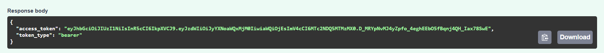

# JSON Web Token (JWT)

## What is JWT?
**JWT (JSON Web Token)** is an open standard (RFC 7519) used for securely transmitting information between parties as a JSON object.  
It is widely used in authentication and authorization systems because it is compact, self-contained, and can be easily verified.

---

## Why is JWT Needed?
- ✅ **Authentication** – After a user logs in, the server generates a JWT and sends it to the client. The client includes this token in subsequent requests to prove identity.
- ✅ **Authorization** – JWTs can carry user roles or permissions, allowing servers to decide what resources the user can access.
- ✅ **Stateless** – The server does not need to store session data. All necessary information is inside the token itself.
- ✅ **Cross-platform** – JWTs are widely supported and can be used across different languages and frameworks.

---

## Structure of a JWT
A JWT consists of **three parts**, separated by dots (`.`):
```bash
    Header.Payload.Signature
```


### 1. Header
- Contains metadata about the token.
- Typically includes:
  - The type of token (`JWT`)
  - The signing algorithm (`HS256`, `RS256`, etc.)

Example:
```json
{
  "alg": "HS256",
  "typ": "JWT"
}
```

### 2. Payload
- Contains the **claims** (statements about the user or entity).
- Claims can be:
  - **Registered claims** – predefined fields like `sub` (subject), `iat` (issued at), `exp` (expiration).
  - **Public claims** – custom fields defined by developers (e.g., `role`, `email`).
  - **Private claims** – information shared between parties that agree on its meaning.

Example:
```json
{
  "sub": "1234567890",
  "name": "John Doe",
  "role": "admin",
  "iat": 1516239022,
  "exp": 1516242622
}
```

### 3. Signature
- Ensures the token has not been altered.
- Created by:
  1. Encoding the header and payload.
  2. Combining them with a secret key.
  3. Applying the algorithm specified in the header.

Example:
```json

HMACSHA256( base64UrlEncode(header) + "." + base64UrlEncode(payload), secret )

{
  "signature": "SflKxwRJSMeKKF2QT4fwpMeJf36POk6yJV_adQssw5c"
}
```
---
### JWT Response



---

